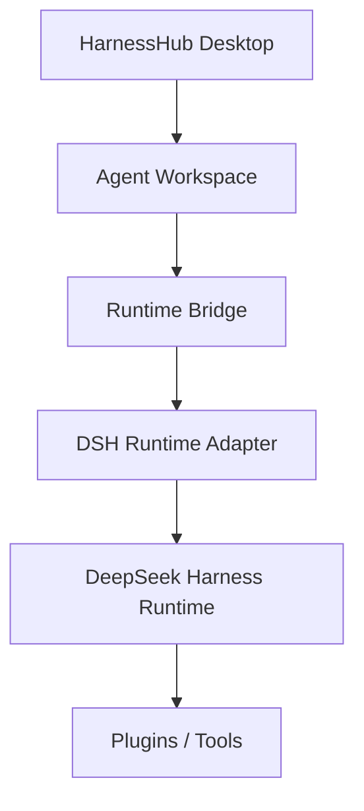
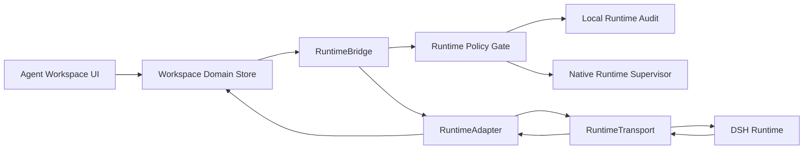
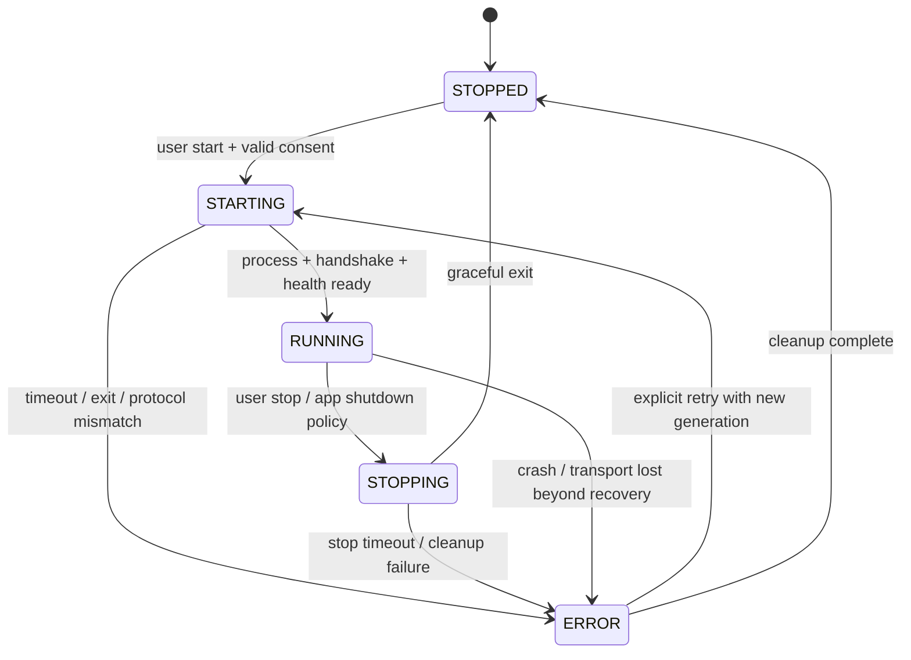
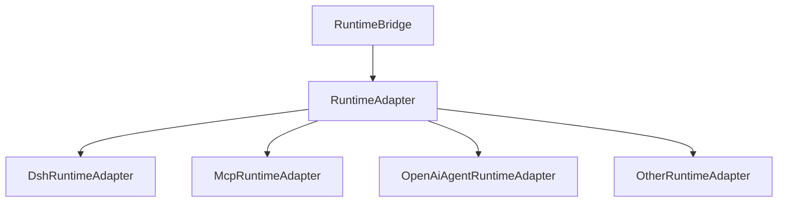

# HarnessHub DSH Runtime Bridge Architecture

状态：Phase 4-B Architecture Design 完成

更新时间：2026-08-20

实现状态：仅设计；没有启动、停止、修改或调用 DSH，没有执行 Agent 或模型请求。

## 1. 决策摘要

HarnessHub 采用方案 B：不嵌入 DSH Web UI，而是作为 DSH Runtime 的管理和用户体验层。



核心边界：

- HarnessHub 拥有桌面体验、用户确认、生命周期意图、状态投影和本地审计；
- DSH 拥有 Agent 执行、Session、Tool、Plugin、审批语义和 Runtime 内部状态；
- Runtime Adapter 把 DSH 的版本化协议转换为 HarnessHub 稳定领域模型；
- Runtime Bridge 不暴露任意命令、任意 RPC method 或原始 DSH 内部对象给 UI；
- HarnessHub API 云端不能直接控制本机 Runtime。

## 2. 当前事实与设计假设

### 2.1 已核验事实

以 `docs/SOURCES.md` 锁定的 DSH commit 为基线：

- DSH 是 Developer Preview，官方明确提示会出现破坏性兼容变化；
- `dsh web` 已有 Host/Client 分层与 channel-independent RPC message model；
- 当前 Web carrier 使用 HTTP 处理 client→host unary request/response；
- 当前 Web carrier 使用 WebSocket 处理 host→client event downlink；
- Session 核心采用事件回放构建客户端状态；
- Runtime 审批/问题属于可回答的 server request，具有稳定关联 ID；
- DSH 架构文档把 Electron IPC carrier 作为未来可替换载体示例；
- 当前协议没有可作为长期兼容承诺的正式 protocol version。

### 2.2 HarnessHub 推论

以下是 HarnessHub 的设计选择，不是 DSH 官方承诺：

1. Phase 4-C 优先适配 DSH 已存在的 HTTP + WebSocket 形态，以降低原型改造范围；
2. HarnessHub 自己定义 `RuntimeBridgeContractVersion`，不能等待 DSH 提供稳定协议版本；
3. DSH 私有协议必须封装在 `DshRuntimeAdapter` 内，Agent Workspace 不能依赖它；
4. 生命周期控制由 Tauri 原生 Supervisor 管理，不通过 DSH RPC 模拟进程所有权；
5. IPC 是未来更强的本地 carrier 候选，但只有 DSH 提供受支持入口并通过跨平台测试后才切换。

## 3. 组件架构



### 3.1 Agent Workspace UI

只消费 HarnessHub 领域对象，不读取：

- DSH 原始 RPC envelope；
- 子进程 PID、端口或 token；
- 原始 stderr；
- Runtime 配置文件或用户凭据；
- 任意命令/路径输入接口。

### 3.2 Workspace Domain Store

维护当前 Runtime 的只读投影：

- lifecycle；
- activity；
- connection；
- health；
- session/event projection；
- plugin inventory；
- pending permission requests；
- safe error summary。

它不是 DSH 的第二套事实数据库。DSH durable Session/Event 是执行事实；HarnessHub 只保存最小本地投影、关联 ID 和 UI 偏好。

### 3.3 RuntimeBridge

统一生命周期、状态、通信和错误语义。Bridge 只接受 typed operation，不接受字符串 method 名、命令或 payload passthrough。

### 3.4 Runtime Policy Gate

在任何进入 Supervisor 或 Adapter 的操作之前检查：

- 用户是否明确发起；
- 当前状态是否允许；
- operation 是否在枚举 allowlist；
- Runtime instance/workspace/generation 是否匹配；
- 是否需要新的权限确认；
- request 是否过期、重复或重放；
- plugin/version 是否属于已验证允许集合。

### 3.5 Native Runtime Supervisor

未来唯一拥有 DSH 子进程句柄的组件：

- 构造固定、版本化 LaunchSpec；
- 启动、观察、停止和清理单个 Runtime instance；
- 管理退出码、超时、崩溃和强制终止升级；
- 生成 instance ID、generation 与本地通信凭证；
- 不接受 UI 提交 executable、args、cwd 或 env map。

Phase 4-B 不实现 Supervisor。

### 3.6 RuntimeAdapter

把某个 Runtime 的安装事实、启动规格、协议和事件转换为统一领域对象。DSH 特有内容只存在于 `DshRuntimeAdapter`。

### 3.7 RuntimeTransport

只负责传输，不决定业务权限：

- unary request/response；
- event stream；
- correlation；
- deadline/cancellation；
- reconnect；
- frame/schema/size validation。

## 4. Runtime Bridge 接口

用户要求的接口保留，但收紧为 typed contract：

```ts
interface RuntimeBridge {
  start(request: StartRuntimeRequest): Promise<RuntimeOperationResult>
  stop(request: StopRuntimeRequest): Promise<RuntimeOperationResult>
  restart(request: RestartRuntimeRequest): Promise<RuntimeOperationResult>
  status(instanceId: RuntimeInstanceId): Promise<RuntimeSnapshot>
  healthCheck(instanceId: RuntimeInstanceId): Promise<RuntimeHealth>
  sendRequest<K extends keyof RuntimeRequestMap>(
    request: RuntimeRequest<K>,
  ): Promise<RuntimeResponse<K>>
}
```

### 4.1 `start()`

输入只能是稳定 ID：

```ts
type StartRuntimeRequest = {
  operationId: OperationId
  adapterKind: RuntimeKind
  installationId: LocalRuntimeInstallationId
  workspaceId: WorkspaceId
  profileId: ManagedProfileId
  consentId: ConsentId
  expectedEnvironmentDigest: Digest
}
```

禁止包含：

- executable path；
- raw CLI args；
- arbitrary environment variables；
- raw workspace path；
- model API key；
- plugin command。

Supervisor 根据受信 Installation、Managed Workspace 与 Adapter version 在原生层重新解析 LaunchSpec。

### 4.2 `stop()`

- 只作用于 HarnessHub 启动并持有 ownership lease 的 instance；
- 默认 graceful stop；
- 超时后必须再次提示才能强制终止，除非进程已崩溃；
- stop 不等同删除 Session、Profile、Plugin 或用户数据；
- 重复 stop 幂等返回当前终态。

### 4.3 `restart()`

不是简单的 stop/start 两个 UI 调用，而是一个可审计 operation：

```text
RESTART_REQUESTED
  -> STOPPING
  -> STOPPED
  -> STARTING(new generation)
  -> RUNNING | ERROR
```

旧 generation 的晚到事件必须丢弃。

### 4.4 `status()`

读取 Bridge 的合并 Snapshot：

- process observation；
- transport connection；
- adapter-reported runtime state；
- last health sample；
- plugin inventory digest；
- pending input count；
- safe error。

不得通过每次 `status()` 触发昂贵命令或启动 Runtime。

### 4.5 `healthCheck()`

健康检查分层：

1. `PROCESS_ALIVE`：Supervisor 持有的进程是否存在；
2. `TRANSPORT_READY`：本地 carrier 是否建立；
3. `PROTOCOL_COMPATIBLE`：握手和 contract version 是否兼容；
4. `RUNTIME_RESPONSIVE`：限定的 health request 是否在 deadline 内响应；
5. `WORKSPACE_READY`：Workspace/Profile 是否匹配预期。

单一 `200 OK` 不能自动代表全部健康。

### 4.6 `sendRequest()`

名称保留，但不是通用 RPC proxy。`RuntimeRequestMap` 只能注册经过评审的 operation，例如：

```ts
interface RuntimeRequestMap {
  'runtime.describe': RuntimeDescribeContract
  'session.list': SessionListContract
  'session.history': SessionHistoryContract
  'session.prompt': SessionPromptContract
  'session.cancel': SessionCancelContract
  'permission.respond': PermissionResponseContract
  'plugin.inventory': PluginInventoryContract
}
```

Phase 4-C 第一版只建议实现：

- `runtime.describe`；
- `plugin.inventory`；
- 只读 event subscription。

`session.prompt`、`permission.respond` 和所有 Agent 执行留在后续独立门槛。

## 5. 通信方案评估

| 方案 | 安全 | 跨平台 | 调试 | 流式事件 | 契约成本 | 结论 |
|---|---|---|---|---|---|---|
| localhost HTTP | 中；必须 loopback、token、Origin、随机端口 | 高 | 最容易 | 需 SSE/WS 辅助 | 低 | 推荐做 unary uplink |
| WebSocket | 中；需要握手鉴权、frame/schema/size 限制 | 高 | 中 | 优秀 | 中 | 推荐做 event downlink |
| OS IPC / stdio / named pipe | 高；可减少开放端口，但仍需 peer/auth 设计 | 中；各 OS 差异明显 | 较难 | 优秀 | 高 | 未来生产强化候选 |
| gRPC | 中；loopback 仍需鉴权 | 高但打包复杂 | 中 | 优秀 | 高 | 当前过重，不采用 |

### 5.1 推荐方案

Phase 4-C 推荐：

```text
Lifecycle:
HarnessHub Native Supervisor -> OS process handle

Unary application requests:
HarnessHub Bridge -> authenticated localhost HTTP -> DSH Adapter endpoint

Runtime events:
DSH Adapter endpoint -> authenticated WebSocket -> HarnessHub Bridge
```

理由：

- 与锁定 DSH Web transport 的 HTTP uplink + WebSocket downlink 方向一致；
- 不需要 HarnessHub 嵌入或抓取 DSH UI；
- HTTP 对 status/describe/inventory 易调试、易限时、易记录；
- WebSocket 适合 Session/Tool/Permission 的长连接事件；
- 协议层与 carrier 分离，未来可换 IPC；
- gRPC 在当前规模增加 codegen、打包、调试和版本面，没有足够收益。

### 5.2 不把生命周期放进 HTTP

`start/stop/restart` 属于本机进程 ownership，不是 Runtime 应用 RPC：

- start 前 HTTP 服务尚不存在；
- 进程崩溃时 HTTP 无法负责清理；
- 只有原生 Supervisor 能可靠持有 child handle 与 generation；
- 远端页面或同机未知客户端不能通过 HTTP 获得进程控制权。

### 5.3 Loopback 安全要求

Phase 4-C 若使用 localhost：

- 只绑定 `127.0.0.1` / `::1`，绝不绑定 `0.0.0.0`；
- OS 分配随机端口，不使用永久固定端口；
- 每次启动生成新的高熵 capability token；
- token 只在 native Bridge 持有，不进入 URL、日志、DOM、localStorage 或云端；
- Renderer 不直接持有 DSH token，所有请求通过收窄的 Tauri command/event surface；
- 校验 Host、Origin 和 instance generation；
- HTTP 与 WS 都要求同一 instance token；
- 只接受注册方法、严格 schema、body/frame size、deadline 与并发上限；
- 进程退出立即撤销 token 并关闭 listener；
- 端口探测成功不等于连接到正确 Runtime，必须完成 nonce challenge 和 protocol handshake。

本地 token 不能防御已经完全控制当前用户账户的恶意进程，因此真实发布仍需 OS IPC/peer credential 或更强进程隔离评审。

### 5.4 IPC 路线

未来只有满足以下条件才迁移 IPC：

- DSH 提供受支持、版本化的 IPC/stdio carrier；
- macOS Unix domain socket、Windows named pipe、Linux Unix socket 具备统一抽象；
- peer identity、权限、cleanup 和 stale endpoint 已测试；
- Adapter contract 不因 carrier 改变；
- HTTP/WS 与 IPC 通过同一协议契约测试。

## 6. Runtime 状态模型

单一枚举会把“是否安装”“进程生命周期”“Agent 活动”和“连接健康”混为一谈。HarnessHub 使用四个正交状态，再派生用户展示状态。

### 6.1 Installation state

```text
NOT_INSTALLED
INSTALLED
INCOMPATIBLE
UNKNOWN
```

### 6.2 Lifecycle state

```text
STOPPED
STARTING
RUNNING
STOPPING
ERROR
```

### 6.3 Activity state

只在 `RUNNING` 时有意义：

```text
IDLE
BUSY
WAITING_INPUT
UNKNOWN
```

### 6.4 Connection state

```text
DISCONNECTED
CONNECTING
READY
DEGRADED
RECONNECTING
```

### 6.5 用户展示状态映射

| 条件 | 展示 |
|---|---|
| installation = NOT_INSTALLED | `NOT_INSTALLED` |
| installation = INSTALLED, lifecycle = STOPPED | `INSTALLED` |
| lifecycle = STARTING | `STARTING` |
| lifecycle = RUNNING, activity = IDLE | `RUNNING` |
| lifecycle = RUNNING, activity = BUSY | `BUSY` |
| lifecycle = RUNNING, activity = WAITING_INPUT | `WAITING_INPUT` |
| lifecycle = STOPPING | `STOPPING` |
| lifecycle = ERROR 或 protocol incompatible | `ERROR` |

### 6.6 RuntimeSnapshot

```ts
type RuntimeSnapshot = {
  instanceId: RuntimeInstanceId
  generation: number
  runtimeKind: RuntimeKind
  adapterVersion: string
  bridgeContractVersion: string
  installation: RuntimeInstallationState
  lifecycle: RuntimeLifecycleState
  activity: RuntimeActivityState
  connection: RuntimeConnectionState
  runtimeVersion: string | null
  protocolCapabilities: RuntimeCapabilities
  workspaceId: WorkspaceId | null
  profileId: ManagedProfileId | null
  pluginInventory: PluginInventorySummary
  pendingInputCount: number
  lastHealthAt: string | null
  lastEventSequence: number | null
  safeError: RuntimeSafeError | null
}
```

PID、token、绝对路径、原始环境和凭据不进入 Renderer Snapshot。

## 7. 生命周期设计



### 7.1 Generation

每次 start/restart 都递增 `generation`：

- event、health result、request/response 必须携带 instance ID + generation；
- 旧 generation 的异步结果直接丢弃并写 debug audit；
- restart 不复用 capability token、connection 或 pending request；
- UI projection 在新 generation ready 前显示 STARTING，不沿用旧 RUNNING。

### 7.2 Readiness

只有以下全部成立才进入 RUNNING：

- child process 已启动；
- authenticated handshake 完成；
- bridge/adapter/runtime contract 兼容；
- health request 成功；
- workspace/profile identity 与 LaunchSpec 一致；
- event downlink ready；
- plugin inventory 可读取或明确标记 DEGRADED。

### 7.3 Shutdown

关闭 Desktop 时的默认策略必须由用户设置明确决定：

- `STOP_WITH_APP`：HarnessHub 管理的 Runtime 一起停止；
- `ASK_IF_BUSY`：BUSY/WAITING_INPUT 时询问；
- `LEAVE_RUNNING`：只允许未来明确支持 detach/reattach 的 Adapter。

Phase 4-C 默认 `STOP_WITH_APP`，不支持后台静默常驻。

## 8. 状态同步与事件一致性

### 8.1 Event envelope

HarnessHub 规范 envelope：

```ts
type RuntimeEventEnvelope<T> = {
  bridgeContractVersion: string
  instanceId: RuntimeInstanceId
  generation: number
  eventId: string
  sequence: number
  occurredAt: string
  kind: RuntimeEventKind
  payload: T
}
```

### 8.2 原则

- event 至少一次投递，UI fold 必须幂等；
- 同一 generation 内按 sequence 排序；
- reconnect 后重新 describe + history/event replay，不信任仅靠内存增量；
- sequence gap 触发 DEGRADED 和 resync；
- unknown event 保留安全 envelope、忽略 payload，并记录 Adapter compatibility warning；
- tool output 和模型内容有独立大小与截断规则；
- answerable permission/question request 使用稳定 request ID，首次回答获胜；
- 晚到、重复或过期回答返回明确 receipt，不重复执行。

## 9. 错误模型

```ts
type RuntimeErrorCode =
  | 'NOT_INSTALLED'
  | 'INCOMPATIBLE_VERSION'
  | 'START_FAILED'
  | 'START_TIMEOUT'
  | 'HANDSHAKE_FAILED'
  | 'PROTOCOL_MISMATCH'
  | 'HEALTH_TIMEOUT'
  | 'TRANSPORT_LOST'
  | 'RUNTIME_CRASHED'
  | 'STOP_TIMEOUT'
  | 'WORKSPACE_MISMATCH'
  | 'PERMISSION_REQUIRED'
  | 'REQUEST_REJECTED'
  | 'RATE_LIMITED'
  | 'ADAPTER_ERROR'
```

Renderer 只获得 `RuntimeSafeError`：

- code；
- 用户可理解 message key；
- retryable；
- recovery action；
- correlation ID；
- redacted details。

原始 stderr、绝对路径、环境变量、模型响应和 token 默认只进入受限本机诊断缓冲区；导出前用户预览并脱敏。

## 10. 权限边界

### 10.1 HarnessHub 可以

- 在用户明确操作后启动/停止自己管理的 Runtime；
- 查询状态、版本、健康和受限 plugin inventory；
- 管理经过验证且与 Installation Manifest 绑定的插件；
- 向用户展示 Tool Activity 和 Permission Request；
- 转发用户对明确请求的 allow/deny；
- 取消自己发起且仍在运行的 Session operation；
- 记录关键本机操作审计。

### 10.2 HarnessHub 不可以

- 将远端 HarnessHub API 响应直接变成本机 Runtime operation；
- 绕过 Adapter 执行命令或调用未注册 method；
- 向 DSH 传递任意 executable/args/env/cwd；
- 读取模型 API key、SSH key、Cookie、环境 Secret 或未授权工作区文件；
- 静默发送 prompt、批准 Tool、回答 Agent 问题或改变 permission policy；
- 将 Verified Developer/LOW Risk 当成运行时权限；
- 在 UI 中隐藏 DSH 实际发起的权限请求；
- Runtime ERROR 时伪装为 RUNNING；
- 未经用户同意上传 Session、Tool Activity、路径或诊断。

### 10.3 Remote command firewall

云端数据只能影响：

- Registry 可见性；
- 安装/更新 eligibility；
- 安全警告；
- compatibility policy。

云端不能产生：

- start/stop/restart；
- prompt；
- tool approval；
- plugin execution；
- local file operation。

本机关键操作必须由本机 UI event + current Session + fresh Consent 生成。

## 11. Audit 模型

关键操作追加记录：

```text
RuntimeAuditEvent

event_id
operation_id
instance_id
generation
workspace_id
actor = LOCAL_USER | SYSTEM_RECOVERY
action
from_state
to_state
consent_id
adapter_kind/version
result
safe_error_code
occurred_at
```

必须审计：

- start/stop/restart request 与结果；
- force stop；
- protocol mismatch；
- crash/recovery；
- plugin inventory change；
- permission request 与 allow/deny；
- prompt/cancel（未来）；
- diagnostics export；
- Adapter override 或 compatibility bypass。

模型内容、Secret、完整路径和大段 Tool output 不进入默认审计。

## 12. Agent Workspace 未来接口

```text
Agent Workspace

├── Conversation
│   ├── event-sourced message projection
│   ├── streaming state
│   └── cancel / retry intent
├── Runtime Status
│   ├── lifecycle / activity / health
│   ├── version / adapter
│   └── reconnect / recovery
├── Plugin List
│   ├── loaded inventory
│   ├── Registry identity mapping
│   └── version / trust / permissions
├── Tool Activity
│   ├── requested / running / completed / failed
│   ├── bounded input/output summary
│   └── correlation to conversation
└── Permission View
    ├── capability / reason / scope
    ├── allow once / deny
    └── durable audit receipt
```

### 12.1 Conversation

- 不复刻 DSH UI；使用标准 RuntimeEvent 生成 HarnessHub 表达；
- message、chunk、tool、approval 分离；
- optimistic user message 必须用 request ID 与 Runtime event 对账；
- reconnect 通过 event replay 重建，不只续接最后一段字符串；
- Phase 4-B 不定义完整聊天视觉设计。

### 12.2 Runtime Status

- 始终可见，不以一个绿色圆点掩盖 DEGRADED；
- 显示 Runtime version、adapter version、workspace、loaded plugins 和 last health；
- BUSY、WAITING_INPUT、RECONNECTING 有明确区分；
- ERROR 提供安全恢复动作，不显示原始命令。

### 12.3 Plugin List

需要三层身份映射：

```text
DSH loaded plugin identity
  -> immutable local installation identity
  -> HarnessHub Registry PluginVersion
```

无法映射的插件显示 `UNMANAGED`，不自动删除，也不继承 Verified Developer 或 Registry 安全结论。

### 12.4 Tool Activity / Permission View

- Tool “已加载”不等于“已执行”；
- 每次高影响 Tool operation 独立展示 scope 和原因；
- Runtime permission policy 是执行权威，HarnessHub 不能伪造已批准状态；
- HarnessHub 的确认必须被 DSH response receipt 和 durable event 对账；
- pending request 在 restart/reconnect 后必须重新确认是否仍有效。

## 13. 多 Runtime 扩展



### 13.1 Adapter contract

```ts
interface RuntimeAdapter {
  readonly kind: RuntimeKind
  readonly adapterVersion: string
  inspectInstallation(snapshot: EnvironmentSnapshot): RuntimeInstallation
  capabilities(): RuntimeCapabilities
  buildLaunchSpec(input: TrustedLaunchInput): NativeLaunchSpecDescriptor
  createTransport(endpoint: NativeEndpointHandle): RuntimeTransport
  handshake(): Promise<RuntimeHandshake>
  describe(): Promise<AdapterRuntimeDescription>
  normalizeEvent(frame: unknown): RuntimeEventEnvelope<unknown>
  listPlugins(): Promise<PluginInventory>
  mapError(error: unknown): RuntimeSafeError
}
```

`NativeLaunchSpecDescriptor` 不是 raw command；最终 executable/args 仍由受信原生 registry 根据 Adapter kind/version 解析。

### 13.2 Capability negotiation

不同 Runtime 不强行假装能力相同：

```ts
type RuntimeCapabilities = {
  lifecycle: 'MANAGED' | 'ATTACH_ONLY'
  conversations: boolean
  streaming: boolean
  toolActivity: boolean
  permissionRequests: boolean
  pluginInventory: boolean
  eventReplay: boolean
  cancellation: boolean
  multiWorkspace: boolean
}
```

Workspace 只显示 Adapter 声明并通过握手验证的能力。缺失能力不会用猜测、CLI scraping 或无效按钮填补。

### 13.3 Adapter 隔离

- DSH RPC method、event 名、Profile、Bundle 概念不进入通用 Bridge；
- MCP Runtime 的 Tool Server 概念不能假装是 DSH Plugin；
- OpenAI Agent Runtime 的 remote Session 不自动获得本机生命周期权限；
- Adapter 单独维护版本矩阵、contract fixtures 和 compatibility tests；
- 一个 Adapter 崩溃或协议不兼容不能影响其他 Runtime instance。

## 14. 数据与隐私

默认只在本机保存：

- Runtime instance metadata；
- lifecycle audit；
- adapter/version compatibility；
- workspace ID 到用户选择路径的受限映射；
- minimal conversation projection cache；
- permission receipt metadata。

默认不上传：

- prompt/response；
- Tool input/output；
- workspace content；
- 绝对路径；
- model/provider credentials；
- DSH config；
- process environment；
- raw stderr。

云端 Registry 与本机 Agent Workspace 使用不同数据域和 retention policy。

## 15. Phase 4-C Prototype 建议

Phase 4-C 不应一开始发送模型请求。建议按以下顺序：

### Slice 1：Contract Fixture

- 实现 RuntimeBridge domain types 和状态机；
- Fixture Adapter 回放已脱敏的 DSH describe/event trace；
- 覆盖 start/stop/restart 的模拟 lifecycle；
- 验证 generation、sequence gap、reconnect 和 stale event；
- 不启动 DSH。

### Slice 2：Read-only DSH Attach

- 只连接用户显式启动的 keyless test Runtime；
- 只允许 handshake、health、describe、plugin inventory 和 event observation；
- 不发 prompt，不审批 Tool，不读 workspace content；
- 使用临时空 workspace/Profile；
- 验证 HTTP/WS trust fence、token、random port 和 shutdown。

### Slice 3：Managed Lifecycle

- Native Supervisor 启动固定、已验证的 DSH test installation；
- start/stop/restart + crash recovery；
- 不接模型凭据；
- 不启用 Agent request；
- 完成外部桌面安全评审后才进入下一 Slice。

### 明确不进入 Phase 4-C 首版

- 真实模型请求；
- Conversation composer；
- Tool execution；
- permission allow；
- plugin installation；
- remote Runtime；
- background daemon；
- 多 Runtime 并发。

## 16. Phase 4-C 进入门槛

1. 锁定 DSH commit/version 和可测试的 protocol fixture；
2. 确认 DSH 是否提供受支持的外部 ApiProxy contract；若没有，Prototype 必须标记 private adapter；
3. 定义 HarnessHub Bridge contract version 与 handshake；
4. 原生 Supervisor threat model 通过；
5. loopback token/Origin/nonce/port 生命周期方案通过；
6. Start/Stop/Restart 状态和超时策略通过；
7. renderer 不持有 raw token/endpoint 的 Tauri command surface 通过；
8. keyless/empty workspace test fixture 准备完成；
9. Audit、diagnostic redaction 与 user consent 字段确认；
10. macOS 单平台 E2E 矩阵和退出清理测试定义完成。

## 17. 非目标

Phase 4-B 没有：

- 启动、停止或重启 DSH；
- 实现 RuntimeBridge package；
- 打开 localhost port；
- 建立 WebSocket；
- 修改 DSH 安装/Profile/配置；
- 执行 Agent、Tool 或 Plugin；
- 发送模型请求；
- 读取 API key；
- 实现 Conversation UI；
- 实现 MCP/OpenAI Runtime Adapter。

本文件只定义 Phase 4-C 之前的架构和安全边界。
