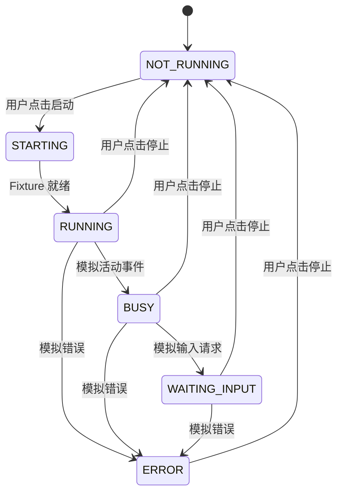

# HarnessHub Runtime Bridge Prototype

状态：Phase 4-C 已实现  
范围：DSH Contract Fixture + Runtime Bridge + Desktop Runtime 页面  
真实 DSH：未连接

## 1. Prototype 目标

Phase 4-C 验证第一个本地 Runtime 管理闭环：

```text
HarnessHub Desktop
        |
DSHRuntimeBridge
        |
ContractDshRuntimeFixture
```

用户可以在 Desktop 中：

- 查看 DSH Fixture 的状态、版本和连接状态；
- 启动与停止 Fixture；
- 查看经过校验的 Runtime 事件；
- 在断线后重新连接；
- 明确知道当前结果不代表真实 DSH 或 Agent 已运行。

## 2. 实现范围

新增 `@harnesshub/runtime-bridge` 包，包含：

- `ContractDshRuntimeFixture`：受控本地契约 Fixture；
- `DSHRuntimeBridge`：生命周期、状态同步、事件验证和错误处理；
- `RuntimeBridge` / `RuntimeFixtureTransport`：后续替换真实 Adapter 的稳定接口；
- 不可变 Runtime Event 与 Audit Event；
- 临时会话、重连和鉴权拒绝。

Fixture 支持：

```text
connect()
start()
stop()
status()
healthCheck()
events()
disconnect / reconnect
```

没有 `exec()`、Shell、任意参数或通用命令透传接口。

## 3. 状态模型

Runtime 状态：

```text
NOT_RUNNING
STARTING
RUNNING
BUSY
WAITING_INPUT
ERROR
```

连接状态独立记录：

```text
DISCONNECTED
CONNECTING
CONNECTED
RECONNECTING
```



## 4. 通信方式

本阶段使用进程内 `RuntimeFixtureTransport` 契约，不连接真实 DSH，也不启动操作系统子进程。

每次连接仍按照未来本地 transport 的安全约束生成：

- `127.0.0.1` loopback origin；
- 随机 ephemeral port 标识；
- 每次会话独立的高熵临时凭据；
- 有效期；
- 每次操作重新验证会话；
- 断线后显式重连。

重要区别：Phase 4-C 只验证 transport 合同和安全语义，随机地址不会真实绑定 TCP 端口。Phase 4-D 只有在确定 DSH 的受支持协议后，才由 Native Supervisor 绑定真实 loopback/IPC carrier。

## 5. 事件流

当前事件：

```text
RUNTIME_STARTED
AGENT_READY
TASK_RUNNING
INPUT_REQUIRED
RUNTIME_STOPPED
RUNTIME_ERROR
```

每个事件包含 schemaVersion、runtimeId、generation、单调递增 sequence、有界 message 和 timestamp。

Bridge 拒绝未知 schema、Runtime ID 不匹配、generation 倒退、重复或乱序 sequence、未知事件或状态、超长 message 和无效 timestamp。

## 6. 审计

记录本机操作主体、连接成功或失败、断开和重连、启动/停止请求与结果、接收的 Runtime 事件以及被拒绝的事件。

调用方只能获得深度冻结的审计副本。临时凭据、endpoint、端口和敏感错误不会进入公开 Snapshot、Event 或 Audit。

## 7. Desktop 体验

新增 Agent Runtime 卡片，展示：

```text
DSH
状态：运行中
版本：0.1.0-fixture.1
连接：已连接

[启动] [停止]
```

旁边展示最近的 Runtime 事件和本地审计数量。界面持续标注 `Contract Fixture`，不会让用户误以为 DSH、模型或 Agent 已真实运行。

## 8. 安全限制

本阶段明确禁止：

- 调用真实模型；
- 执行 Agent 或 Tool；
- 连接或启动真实 DSH；
- 安装真实插件；
- 自动安装 DSH；
- 执行 Shell、npm 或任意用户参数；
- 修改 PATH、环境变量、Profile 或系统文件；
- 把临时凭据暴露给 UI、日志或 Audit；
- 由云端 API 发起本机 Runtime 操作。

Fixture 运行仅改变内存状态。退出 Desktop 后状态不会保留。

## 9. 测试覆盖

- 连接、启动、健康检查和停止；
- `STARTING` → `RUNNING` 状态同步；
- BUSY、WAITING_INPUT 和 ERROR；
- 断开连接与重连；
- 错误凭据拒绝；
- 凭据和 endpoint 不进入公开数据；
- 审计副本不可修改；
- Desktop Fixture 提示、控制按钮和事件展示。

## 10. Phase 4-D 真实 DSH 接入计划

Phase 4-D 不应一次开放 Agent 执行。建议顺序：

1. Native Supervisor 启动锁定版本的受控 DSH 测试实例；
2. 完成协议握手、版本协商和健康检查；
3. 只读读取 Runtime 状态与已加载插件；
4. 验证真实断线、崩溃、超时和重连；
5. 经安全评审后，再单独设计 Conversation 与 Tool approval。

进入 Phase 4-D 前必须具备：锁定 DSH commit/version、受支持的 transport contract、真实 loopback/IPC peer authentication、进程归属和清理策略、无模型凭据的集成测试 Fixture，以及不允许任意命令透传的原生 allowlist。
